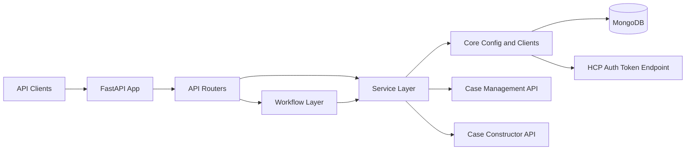
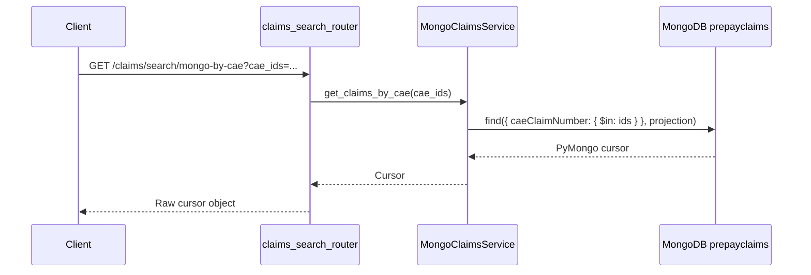
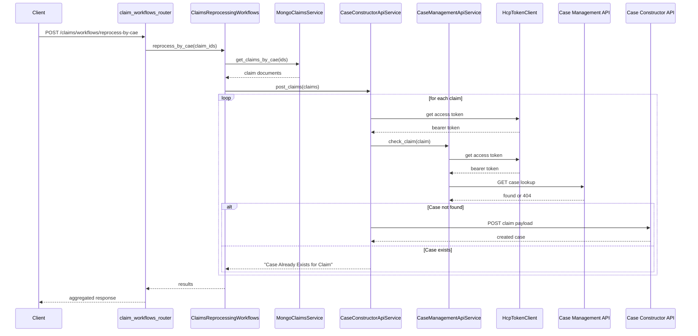
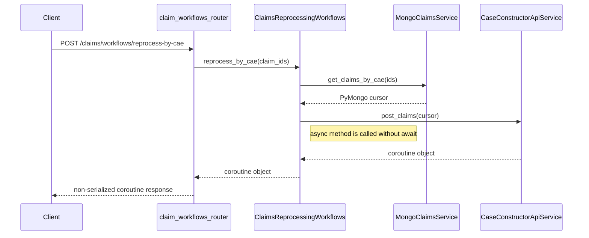
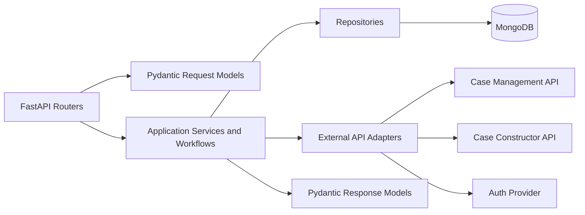

# FWAE Ingress Support API: Feature and Architecture Analysis

## Scope

This document describes the application as it exists in the repository today, not the broader intended end-state implied by the migration guide. It covers:

- feature inventory
- directory structure
- folder and file responsibilities
- logical architecture
- current data flows
- integration points
- architectural risks and recommended target shape

## Executive Summary

`fwae-ingress-support-api` is a small FastAPI service intended to support FWAE ingress operational workflows. The current codebase is a scaffold with one partially implemented search feature and one partially implemented claim reprocessing workflow. The package structure suggests a layered design:

- `api` for HTTP routing
- `workflows` for orchestration
- `services` for business and integration logic
- `core` for configuration and low-level clients
- `models` for schemas

That structure is directionally sound, but the implementation is incomplete:

- only two routers are mounted in the app
- only CAE-based search and CAE-based reprocessing are partially implemented
- three declared workflow endpoints call methods that do not exist
- the search route returns a raw Mongo cursor rather than a response model
- the reprocessing workflow calls an async service without awaiting it
- several client and service modules are placeholders
- test coverage is effectively absent
- packaging and containerization are not currently complete

The result is a repo with a reasonable target architecture but a limited, non-production-ready current runtime implementation.

## Feature Inventory

### Currently Mounted API Surface

| Endpoint | Purpose | Backing implementation | Status |
| --- | --- | --- | --- |
| `GET /claims/search/mongo-by-cae` | Query Mongo claims by CAE claim number | `claims_search_router` -> `MongoClaimsService.get_claims_by_cae` | Partially implemented |
| `POST /claims/workflows/reprocess-by-cae` | Reprocess claims found by CAE identifier | `claim_workflows_router` -> `ClaimsReprocessingWorkflows.reprocess_by_cae` -> Mongo + Case Management + Case Constructor | Partially implemented |
| `POST /claims/workflows/reprocess-by-icn` | Reprocess claims by ICN | Route exists, workflow method missing | Declared but broken |
| `POST /claims/workflows/reprocess-by-guid` | Reprocess claims by GUID | Route exists, workflow method missing | Declared but broken |
| `POST /claims/workflows/reprocess-by-vendorid` | Reprocess claims by vendor ID | Route exists, workflow method missing | Declared but broken |

### Implemented Supporting Capabilities

| Capability | Description | Status |
| --- | --- | --- |
| Mongo connectivity | Creates a shared `MongoClient`, selects database `ufwae-claims-db`, reads `prepayclaims` collection | Implemented |
| Claim projection trimming | Removes selected nested `_id` and `__v` fields from Mongo results | Implemented |
| OAuth token acquisition | Obtains access token using shared HCP auth endpoint | Implemented |
| Case existence check | Calls Case Management API before posting to Case Constructor API | Implemented, but contract is fragile |
| Sequential claim posting | Sends claims one at a time with a one-second delay between claims | Implemented |

### Declared but Not Yet Implemented

| Area | Modules | Notes |
| --- | --- | --- |
| Additional API surfaces | `api/github_api_router.py`, `api/npm_workflows_router.py`, `api/claim_reports.py` | Files exist but are empty |
| Additional integrations | Cosmos DB, Azure Service Bus, Oracle, NPM, GitHub clients/services | Files exist but are mostly placeholders |
| Domain models | `models/` | No request/response schemas yet |
| Logging framework | `core/logger.py` | Placeholder |
| Test suite | `tests/` | Only `__init__.py` exists |

## Directory Structure

`__pycache__` folders are omitted below.

```text
.
├── .env.example                       # Local env template observed in workspace; currently untracked
├── Dockerfile
├── README.md
├── poetry.lock
├── pyproject.toml
├── docs/
│   ├── APPLICATION_FEATURE_AND_ARCHITECTURE.md
│   └── CLAIMS_WORKFLOWS_SEARCH_MIGRATION_GUIDE.md
├── tests/
│   └── __init__.py
└── fwae_ingress_support_api/
    ├── __init__.py
    ├── fwae_ingress_support_main.py
    ├── api/
    │   ├── __init__.py
    │   ├── claim_reports.py
    │   ├── claim_workflows_router.py
    │   ├── claims_search_router.py
    │   ├── github_api_router.py
    │   └── npm_workflows_router.py
    ├── core/
    │   ├── __init__.py
    │   ├── config.py
    │   ├── logger.py
    │   └── clients/
    │       ├── __init__.py
    │       ├── azure_servicebus_client.py
    │       ├── cosmos_db_client.py
    │       ├── github_api_client.py
    │       ├── hcp_token_client.py
    │       ├── mongo_client.py
    │       ├── npm_client.py
    │       └── oracle_client.py
    ├── models/
    │   └── __init__.py
    ├── services/
    │   ├── __init__.py
    │   ├── azure_servicebus_service.py
    │   ├── case_constructor_api_service.py
    │   ├── case_managment_api_service.py
    │   ├── cosmos_db_service.py
    │   └── mongo_claims_service.py
    └── workflows/
        ├── __init__.py
        └── claim_reprocessing_workflows.py
```

## Folder and File Responsibilities

### Repository Root

| Path | Purpose | Current state |
| --- | --- | --- |
| `.env.example` | Sample environment configuration for app, Mongo, auth, and external APIs | Present in workspace but untracked |
| `pyproject.toml` | Python package metadata and dependencies | Incomplete dependency list |
| `poetry.lock` | Locked dependency graph | Present |
| `README.md` | Developer setup and run instructions | More complete than code implementation |
| `Dockerfile` | Container build definition | Truncated and not runnable in current form |
| `docs/CLAIMS_WORKFLOWS_SEARCH_MIGRATION_GUIDE.md` | Migration intent from Node.js to Python | Useful target-state reference |
| `tests/__init__.py` | Test package marker | No actual tests exist |

### Application Package

| Path | Purpose | Current state |
| --- | --- | --- |
| `fwae_ingress_support_api/__init__.py` | Package marker | Empty |
| `fwae_ingress_support_api/fwae_ingress_support_main.py` | FastAPI application entry point; mounts routers | Minimal but valid |

### `api/`

| Path | Purpose | Current state |
| --- | --- | --- |
| `api/__init__.py` | Re-exports mounted routers | Implemented |
| `api/claim_workflows_router.py` | Declares reprocessing endpoints under `/claims/workflows` | Partially implemented; 3 routes call missing methods |
| `api/claims_search_router.py` | Declares search endpoint under `/claims/search` | Partially implemented; response shape not normalized |
| `api/claim_reports.py` | Intended reporting routes | Empty placeholder |
| `api/github_api_router.py` | Intended GitHub integration routes | Empty placeholder |
| `api/npm_workflows_router.py` | Intended NPM workflow routes | Empty placeholder |

### `workflows/`

| Path | Purpose | Current state |
| --- | --- | --- |
| `workflows/__init__.py` | Re-exports workflow singleton | Implemented |
| `workflows/claim_reprocessing_workflows.py` | Orchestrates claim reprocessing use case | Only `reprocess_by_cae` exists; async usage is incorrect |

### `services/`

| Path | Purpose | Current state |
| --- | --- | --- |
| `services/__init__.py` | Re-exports service singletons | Implemented |
| `services/mongo_claims_service.py` | Reads claims from Mongo and applies field projection | Implemented for CAE search only |
| `services/case_constructor_api_service.py` | Posts claims to Case Constructor API after case existence check | Implemented, sequential, async |
| `services/case_managment_api_service.py` | Checks whether a claim already exists in Case Management API | Implemented, async, naming typo in filename |
| `services/azure_servicebus_service.py` | Intended Service Bus business wrapper | Empty placeholder |
| `services/cosmos_db_service.py` | Intended Cosmos DB business wrapper | Empty placeholder |

### `core/`

| Path | Purpose | Current state |
| --- | --- | --- |
| `core/__init__.py` | Re-exports app-wide shared objects | Implemented |
| `core/config.py` | Central settings model and environment variable mapping | Implemented |
| `core/logger.py` | Intended logging configuration | Empty placeholder |

### `core/clients/`

| Path | Purpose | Current state |
| --- | --- | --- |
| `core/clients/__init__.py` | Re-exports Mongo database object | Implemented |
| `core/clients/mongo_client.py` | Creates shared `MongoClient` and selects DB | Implemented |
| `core/clients/hcp_token_client.py` | Fetches OAuth token for downstream APIs | Implemented |
| `core/clients/github_api_client.py` | Intended GitHub API transport client | Placeholder with import only |
| `core/clients/azure_servicebus_client.py` | Intended Service Bus transport client | Empty placeholder |
| `core/clients/cosmos_db_client.py` | Intended Cosmos DB transport client | Empty placeholder |
| `core/clients/npm_client.py` | Intended NPM transport client | Empty placeholder |
| `core/clients/oracle_client.py` | Intended Oracle transport client | Empty placeholder |

### `models/`

| Path | Purpose | Current state |
| --- | --- | --- |
| `models/__init__.py` | Placeholder for domain and API schemas | Empty |

## Logical Architecture

### Current Layering



### Architectural Intent

The codebase is trying to follow a layered monolith pattern:

- routers own HTTP concerns
- workflows own use-case orchestration
- services own business rules and external coordination
- core owns configuration and low-level clients

That separation is a good foundation. The main issue is that the runtime behavior does not consistently respect the boundaries yet. Several responsibilities are still blurred:

- routers expose raw persistence results
- workflows return un-awaited async service calls
- service contracts use ad hoc string sentinels instead of typed results
- low-level clients are created as import-time singletons rather than via dependency injection or app lifespan hooks

## Runtime Components and Integrations

### Internal Components

| Component | Responsibility |
| --- | --- |
| `FastAPI app` | Starts HTTP service and mounts routers |
| `claims_search_router` | Handles claim search requests |
| `claim_workflows_router` | Handles claim reprocessing requests |
| `ClaimsReprocessingWorkflows` | Orchestrates reprocessing flow |
| `MongoClaimsService` | Retrieves claims from Mongo |
| `CaseManagementApiService` | Checks for existing cases |
| `CaseConstructorApiService` | Creates new cases for claims |
| `HcpTokenClient` | Obtains OAuth bearer tokens |
| `Settings` | Loads environment-backed configuration |

### External Dependencies

| Dependency | Purpose | Integration style |
| --- | --- | --- |
| MongoDB | Source of claim documents | Shared `pymongo.MongoClient` |
| HCP auth endpoint | Shared token provider | `httpx.AsyncClient.post()` |
| Case Management API | Check whether a case already exists | `httpx.AsyncClient.get()` |
| Case Constructor API | Create a case for a claim | `httpx.AsyncClient.post()` |

## Data Model and Query Behavior

### Claim Retrieval

The only implemented query path uses the Mongo field:

- `claimMessage.body.claim.caeClaimNumber`

It targets:

- database: `ufwae-claims-db`
- collection: `prepayclaims`

### Projection Rules

When querying Mongo, the service removes the following fields from returned documents:

- `_id`
- `claimMessage.body.claim.subscriber._id`
- `claimMessage.body.claim.patient._id`
- `claimMessage.trailer.lineCounts._id`
- `claimMessage.trailer.claimCounts._id`
- `claimMessage.body.recommendation.summary.claimSummary._id`
- `__v`

This implies the service is intended to expose a cleaned operational claim payload rather than the raw document.

## Data Flow Diagrams

### 1. Search by CAE: Current Flow



Current-state note:

- the route returns the Mongo cursor directly rather than a list of serialized claim DTOs
- error handling is based on `urllib` exceptions even though the implementation uses `pymongo`

### 2. Reprocess by CAE: Intended Business Flow



### 3. Reprocess by CAE: As-Coded Execution Path



Current-state note:

- the business flow is conceptually clear, but the current sync/async boundary prevents the happy path from completing correctly

## Configuration Surface

The application configuration is centralized in `core/config.py`.

### Primary Settings

| Variable | Purpose |
| --- | --- |
| `PORT` | HTTP listening port |
| `MONGO_URI` | MongoDB connection string |
| `CASE_CONSTRUCTOR_API_URL` | Case Constructor endpoint |
| `CASE_CONSTRUCTOR_API_CLIENT_ID` | OAuth client ID for Case Constructor |
| `CASE_CONSTRUCTOR_API_CLIENT_SECRET` | OAuth client secret for Case Constructor |
| `CASE_CONSTRUCTOR_HCP_AUTH_SCOPE` | OAuth scope for Case Constructor |
| `CASE_CONSTRUCTOR_HCP_AUTH_URL` | Service-specific auth URL |
| `CASE_CONSTRUCTOR_HCP_AUTH_GRANT_TYPE` | Service-specific grant type |
| `CASE_MGMT_API_URL` | Case Management endpoint |
| `CASE_MGMT_API_CLIENT_ID` | OAuth client ID for Case Management |
| `CASE_MGMT_API_CLIENT_SECRET` | OAuth client secret for Case Management |
| `CASE_MGMT_HCP_AUTH_SCOPE` | OAuth scope for Case Management |
| `CASE_MGMT_HCP_AUTH_URL` | Service-specific auth URL |
| `CASE_MGMT_HCP_AUTH_GRANT_TYPE` | Service-specific grant type |
| `HCC_AUTH_URL` | Shared HCP auth URL actually used by `HcpTokenClient` |
| `HCC_AUTH_GRANT_TYPE` | Shared OAuth grant type actually used by `HcpTokenClient` |

### Configuration Observations

- `CaseConstructorApiSettings` and `CaseManagementApiSettings` include service-specific auth URL and grant type fields.
- `HcpTokenClient` does not consume those service-specific values; it uses only global `HCC_AUTH_URL` and `HCC_AUTH_GRANT_TYPE`.
- This means the per-service auth settings exist in configuration but are not functionally used.

## Dependency and Packaging Assessment

### Declared Dependencies

`pyproject.toml` declares:

- `fastapi`
- `uvicorn`
- `pydantic`
- `httpx`
- `pytest`
- `pytest-asyncio`

### Missing Runtime Dependencies

The source code also imports packages not declared in `pyproject.toml`:

- `pydantic-settings`
- `pymongo`

This means a clean installation from the current package manifest is incomplete for the actual runtime code.

### Containerization Assessment

The `Dockerfile` is not currently complete:

- it ends with `CM` instead of a valid `CMD`
- it copies only `pyproject.toml` before `pip install .`, which may be insufficient depending on packaging expectations

## Architectural Risks and Gaps

### 1. Incomplete route-to-workflow contract

Three mounted endpoints call workflow methods that do not exist:

- `reprocess_by_icn`
- `reprocess_by_guid`
- `reprocess_by_vendorid`

This creates an API surface that advertises capability the service does not provide.

### 2. Sync/async boundary is broken

`ClaimsReprocessingWorkflows.reprocess_by_cae()` is synchronous, but it invokes async `post_claims()` without awaiting it. This is the single largest runtime correctness issue in the current code.

### 3. Response contracts are not defined

There are no request or response models. Consequences:

- Mongo search returns a raw cursor
- workflow responses are ad hoc
- downstream callers have no stable contract

### 4. Import-time singleton construction

Settings, Mongo connection objects, and service singletons are created during import. That increases coupling and makes:

- testing harder
- startup failure modes less controllable
- alternate configuration injection harder

### 5. Placeholder modules create architectural ambiguity

The codebase advertises integrations with Cosmos DB, Service Bus, Oracle, GitHub, and NPM, but those modules are mostly empty. The directory structure suggests a broader platform service than the current implementation supports.

### 6. Error handling does not match the active libraries

Examples:

- search route catches `urllib` exceptions, but it uses a Mongo service
- case management check returns magic strings instead of typed outcomes
- no centralized exception mapping exists

### 7. Observability is not implemented

There is no meaningful logging setup, correlation strategy, metrics, or audit trail configuration despite the operational nature of the domain.

### 8. Test coverage is absent

The repo currently has no executable unit or integration tests for:

- route validation
- Mongo query behavior
- workflow orchestration
- external API failure handling

## Recommended Target Architecture

### Target Design Principles

- keep the existing high-level package split
- make all HTTP-facing flows consistently async
- introduce explicit DTOs and domain result types
- separate repository logic from orchestration
- use app startup/lifespan wiring instead of import-time singletons
- make only implemented routes visible

### Proposed Layer Model



### Recommended Module Responsibilities

| Layer | Recommended responsibility |
| --- | --- |
| `api` | Routing, request validation, response shaping, HTTP error mapping |
| `models` | Request DTOs, response DTOs, domain enums, result models |
| `workflows` | Multi-step operational use cases such as claim reprocessing |
| `services` | Domain services and orchestration helpers |
| `core/clients` | Low-level transport and infrastructure adapters |
| `core` | Configuration, logging, dependency wiring |

### Recommended Near-Term Refactor Sequence

1. Hide or remove routes whose workflows are not implemented.
2. Convert mounted routes and workflows to fully async execution.
3. Add request and response models for search and reprocessing.
4. Convert Mongo cursor output into serialized lists or paged result objects.
5. Introduce identifier-based repository methods for CAE, ICN, GUID, and vendor ID.
6. Replace sentinel strings with typed result enums or response models.
7. Add logging, health checks, and test coverage.
8. Finish dependency manifest and repair Docker packaging.

## Suggested Canonical Feature Set

Once the service is completed, the most coherent feature set for this application would be:

- claim search by CAE, ICN, GUID, and vendor ID
- claim reprocessing by those same identifiers
- optional error-log and debug-log driven reprocessing
- case existence validation before case construction
- operational reporting endpoints
- reusable infrastructure adapters for Mongo, auth, and future support-system integrations

## Conclusion

The repository already contains the skeleton of a maintainable support API, but it is still a scaffold rather than a finished service. The most important architectural conclusion is that the code structure is better than the current runtime behavior. The right next step is not a broad redesign; it is to complete the existing layered design, tighten contracts, and remove or hide unfinished surface area until the implementation catches up.
