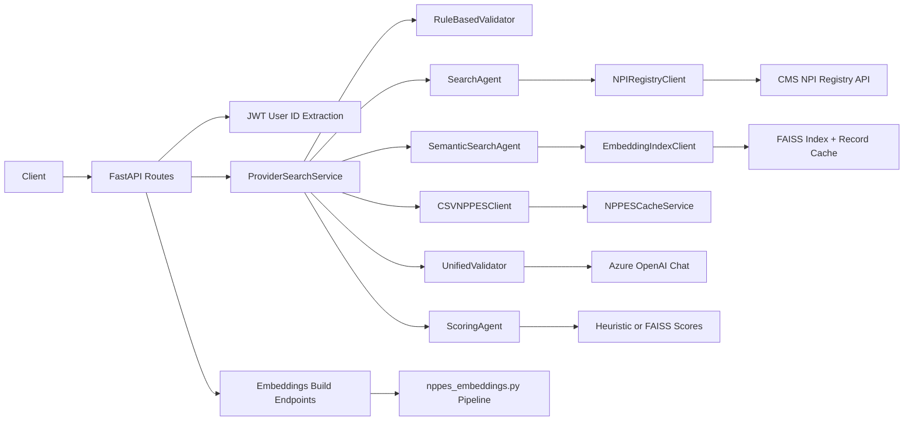
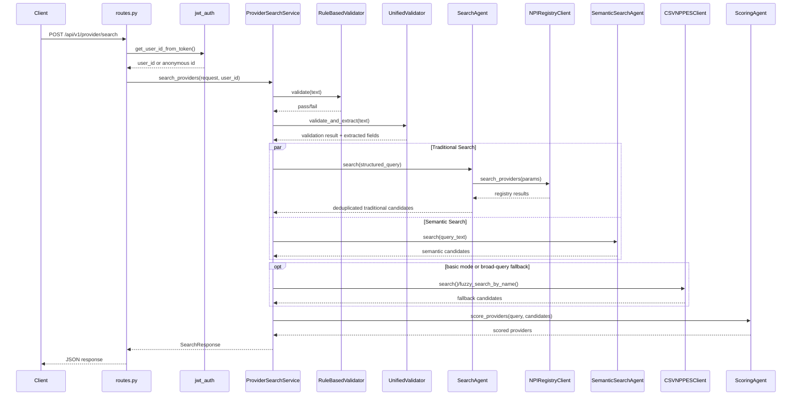
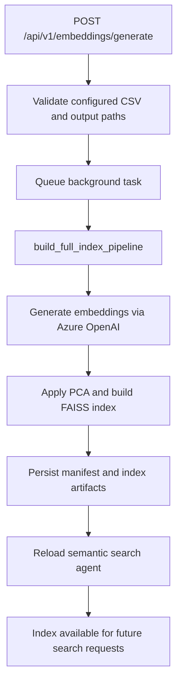
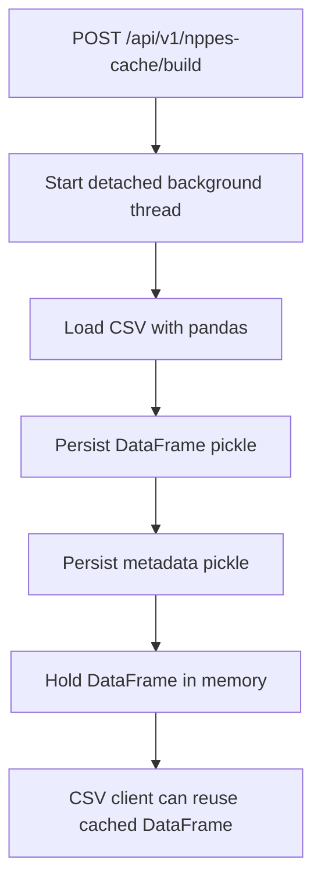

# RQ Submissions Provider Search API: Feature and Architecture Analysis

## Scope

This document analyzes the repository as checked out locally from `https://github.com/optuminsight-payer/rq-submissions-provider-search-api` on April 17, 2026. It describes:

- implemented features
- active and dormant modules
- directory structure
- folder and file responsibilities
- current runtime data flows
- deployment architecture
- architectural risks and inconsistencies

This is a current-state document. It distinguishes between what the README advertises, what the directory structure suggests, and what the code actually executes.

## Executive Summary

`rq-submissions-provider-search-api` is a FastAPI-based provider lookup service that combines deterministic validation, LLM-assisted extraction, external provider registry search, optional FAISS-based semantic search, optional CSV fallback, heuristic ranking, and operational endpoints for embedding generation and NPPES DataFrame cache management.

At a high level, the architecture is sound:

- `api` handles HTTP concerns
- `services` orchestrate use cases
- `agents` encapsulate AI/search/ranking behaviors
- `clients` encapsulate external data access
- `core` centralizes configuration, auth helpers, and logging
- `schemas` define API contracts

However, the codebase is also carrying substantial legacy and experimental material:

- README describes a conversation-refinement feature that is explicitly disabled in the service layer
- multiple modules are fully commented out and are effectively dead code
- several docstrings still describe a 3-source architecture even though the active `SearchAgent` only queries the NPI Registry
- semantic search is available in code, but Helm values disable index loading by default
- scoring docstrings still describe embedding-based ranking, but the live implementation now uses FAISS scores or heuristic scoring only
- deployment templates contain at least one likely bug (`targetPort` key mismatch) and probe wiring does not use the dedicated readiness/liveness endpoints implemented by the app

This is not a small scaffold. It is a substantial application with real functionality, but it is in a mixed state where product behavior, docs, and deployment configuration have drifted apart.

## Feature Inventory

### Actively Implemented Runtime Features

| Feature | Description | Status |
| --- | --- | --- |
| Free-form provider search | Accepts natural language or semi-structured text and returns ranked provider matches | Implemented |
| JWT-based user identification | Extracts user identity from JWT or falls back to anonymous fingerprint | Implemented |
| Rule-based input validation | Rejects empty, non-English, and encoding-problem requests without calling an LLM | Implemented |
| Unified validation + extraction | Uses one Azure OpenAI structured-output call to validate healthcare context and extract structured query fields | Implemented |
| NPI Registry search | Queries CMS NPPES Registry with retry, caching, rate limiting, and circuit breaker behavior | Implemented |
| Semantic FAISS search | Queries prebuilt sharded or legacy FAISS indexes if index loading is enabled and data is present | Implemented |
| CSV fallback search | Uses cached or directly loaded NPPES CSV data for basic mode and broad-query fallback | Implemented |
| Heuristic scoring | Ranks providers via field matching and FAISS-derived scores | Implemented |
| Embedding generation | Triggers background FAISS/embedding index build pipeline | Implemented |
| Semantic index reload | Reloads semantic index from mounted storage without pod restart | Implemented |
| NPPES DataFrame cache build | Builds and persists a pickled DataFrame cache from large CSV input | Implemented |
| Health and probe endpoints | Root, health, liveness, readiness, and embedding-status endpoints | Implemented |

### Feature Areas Present but Disabled or Dormant

| Area | Files | Current state |
| --- | --- | --- |
| Conversation refinement | `services/conversation_service.py`, commented code in `services/provider_search_service.py`, schema comments | Disabled due to bug |
| Old 2-stage LLM validation path | `agents/context_validator.py`, `agents/text_validator.py`, `agents/parsing_agent.py` | Entire modules commented out |
| Explanation generation | `agents/explanation_llm.py`, commented explanation calls in `services/provider_search_service.py` | Disabled |
| Oracle-first search path inside `SearchAgent` | `agents/search_agent.py` plus `clients/oracle_nppes_client.py` | Client exists, active `SearchAgent` path does not use it |
| Legacy semantic search service wrapper | `services/semantic_search_agent.py` | Present but not referenced in active orchestration |

### Public HTTP Surface

#### Search Endpoints

| Endpoint | Purpose | Notes |
| --- | --- | --- |
| `POST /api/v1/provider/search` | Full provider search | Uses JWT-derived user ID, rule-based validation, unified validator, NPI Registry, optional FAISS, optional CSV fallback |
| `POST /api/v1/search` | Alias of full provider search | Same handler |
| `POST /api/v1/provider/search/basic` | Basic provider search | Disables semantic search and relies on traditional plus CSV fallback path |
| `POST /api/v1/search/basic` | Alias of basic search | Same handler |

#### Semantic Index Management

| Endpoint | Purpose |
| --- | --- |
| `POST /api/v1/semantic/reload` | Reload semantic search index from storage |
| `GET /api/v1/semantic/info` | Report semantic index availability and metadata |

#### NPPES Cache Management

| Endpoint | Purpose |
| --- | --- |
| `POST /api/v1/nppes-cache/build` | Start background DataFrame cache build |
| `GET /api/v1/nppes-cache/status` | Track cache build state |
| `GET /api/v1/nppes-cache/info` | Return cache metadata |
| `POST /api/v1/nppes-cache/clear` | Clear in-memory DataFrame cache |

#### Embedding / Index Build Endpoints

| Endpoint | Purpose |
| --- | --- |
| `POST /api/v1/embeddings/generate` | Build embeddings and FAISS index in a background task |
| `GET /api/v1/embeddings/status` | Report current or last embedding build task |
| `POST /api/v1/embeddings/reload` | Reload semantic index after embeddings update |

#### Health / Ops Endpoints

| Endpoint | Purpose |
| --- | --- |
| `GET /` | Basic service status |
| `GET /health` | Detailed health response including semantic status |
| `GET /livez` | Liveness probe |
| `GET /readyz` | Readiness probe |

## Directory Structure

`__pycache__` and notebook checkpoint artifacts are omitted below.

```text
.
├── Dockerfile
├── README.md
├── entrypoint.sh
├── poetry.lock
├── pyproject.toml
├── test_trails.ipynb
├── vitals.yaml
├── chart/
│   ├── Chart.yaml
│   ├── templates/
│   │   ├── deployment.yaml
│   │   ├── hpa.yaml
│   │   ├── ingress-ltm.yaml
│   │   ├── ingress.yaml
│   │   ├── networkPolicy.yaml
│   │   └── service.yaml
│   └── values/
│       ├── dev.yaml
│       ├── prd.yaml
│       ├── stg.yaml
│       └── tst.yaml
├── docs/
│   └── APPLICATION_FEATURE_AND_ARCHITECTURE.md
└── provider_search_api/
    ├── __init__.py
    ├── provider_search_main.py
    ├── api/
    │   └── routes.py
    ├── agents/
    │   ├── context_validator.py
    │   ├── explanation_llm.py
    │   ├── language_validator.py
    │   ├── parsing_agent.py
    │   ├── rule_based_validator.py
    │   ├── scoring_agent.py
    │   ├── search_agent.py
    │   ├── semantic_search_agent.py
    │   ├── text_validator.py
    │   └── unified_validator.py
    ├── clients/
    │   ├── csv_nppes_client.py
    │   ├── npi_registry_client.py
    │   └── oracle_nppes_client.py
    ├── core/
    │   ├── __init__.py
    │   ├── jwt_auth.py
    │   ├── logging_config.py
    │   ├── settings.py
    │   └── token_tracker.py
    ├── schemas/
    │   └── models.py
    ├── services/
    │   ├── conversation_service.py
    │   ├── embedding_index_client.py
    │   ├── nppes_cache_service.py
    │   ├── provider_search_service.py
    │   └── semantic_search_agent.py
    └── utils/
        ├── embedding_cli.py
        └── nppes_embeddings.py
```

## Folder and File Responsibilities

### Repository Root

| Path | Responsibility | Notes |
| --- | --- | --- |
| `README.md` | Product and developer documentation | More ambitious than live behavior in several areas |
| `pyproject.toml` | Package metadata, dependencies, and environment-specific config defaults | Also doubles as configuration store |
| `poetry.lock` | Locked dependency graph | Present |
| `Dockerfile` | Container build definition | Valid build path, but runtime uses plain Python entrypoint, not Gunicorn |
| `entrypoint.sh` | Container process launcher | Runs `python -m provider_search_api.provider_search_main` |
| `vitals.yaml` | Governance/project metadata | Not part of runtime |
| `test_trails.ipynb` | Notebook artifact | Not part of service runtime |
| `chart/` | Helm chart for Kubernetes deployment | Includes env-specific values and ingress/service/probe templates |

### `provider_search_api/`

| Path | Responsibility | Notes |
| --- | --- | --- |
| `__init__.py` | Loads and merges config from `pyproject.toml` plus env vars | Import-time config side effect |
| `provider_search_main.py` | FastAPI app, lifespan logic, embeddings endpoints, health endpoints | Main runtime entrypoint |

### `api/`

| Path | Responsibility | Notes |
| --- | --- | --- |
| `api/routes.py` | Search endpoints, semantic management endpoints, NPPES cache endpoints | Main API router mounted under `/api/v1` |

### `agents/`

| Path | Responsibility | Notes |
| --- | --- | --- |
| `rule_based_validator.py` | Fast deterministic input validation | Active |
| `unified_validator.py` | Azure OpenAI-based combined validation and extraction | Active |
| `search_agent.py` | Traditional provider lookup orchestration against NPI Registry | Active but docs overstate sources |
| `semantic_search_agent.py` | Active FAISS semantic search wrapper over `EmbeddingIndexClient` | Active |
| `scoring_agent.py` | Ranking layer using FAISS scores or heuristic rules | Active |
| `language_validator.py` | Older standalone language/encoding validator | Compiles, but not used in active request path |
| `context_validator.py` | Old LLM validation component | Entirely commented out |
| `parsing_agent.py` | Old LLM parsing component | Entirely commented out |
| `text_validator.py` | Old two-stage validator wrapper | Entirely commented out |
| `explanation_llm.py` | Intended natural-language explanation generator | Disabled/minimal |

### `clients/`

| Path | Responsibility | Notes |
| --- | --- | --- |
| `npi_registry_client.py` | Resilient CMS NPI Registry HTTP client with caching, retry, rate limiting, circuit breaker | Active |
| `csv_nppes_client.py` | CSV-backed provider lookup and fuzzy search client | Active through fallback paths |
| `oracle_nppes_client.py` | Oracle NPPES lookup client with connection pooling | Implemented but not used by live `SearchAgent` path |

### `services/`

| Path | Responsibility | Notes |
| --- | --- | --- |
| `provider_search_service.py` | Main application use-case orchestration | Active |
| `embedding_index_client.py` | Low-level sharded/single-file FAISS index loader and searcher | Active |
| `nppes_cache_service.py` | Builds, persists, and serves cached DataFrame | Active |
| `conversation_service.py` | Intended in-memory conversation state manager | Entirely commented out |
| `semantic_search_agent.py` | Legacy semantic search wrapper using older utility path | Present but not referenced by live orchestration |

### `core/`

| Path | Responsibility | Notes |
| --- | --- | --- |
| `settings.py` | Settings facade over env vars + `pyproject.toml` config | Active |
| `jwt_auth.py` | JWT decode helper and anonymous fallback identity generation | Active |
| `logging_config.py` | Logging setup helpers | Active |
| `token_tracker.py` | Token/cost usage accounting for LLM/embedding usage | Active, but some tracked paths are now disabled |

### `schemas/`

| Path | Responsibility |
| --- | --- |
| `models.py` | Request/response DTOs and provider search domain models |

### `utils/`

| Path | Responsibility |
| --- | --- |
| `embedding_cli.py` | CLI entrypoint for embeddings/index operations |
| `nppes_embeddings.py` | Embedding generation, PCA, FAISS build, and legacy search helpers |

### `chart/`

| Path | Responsibility |
| --- | --- |
| `templates/deployment.yaml` | Pod spec, env var injection, probes, volume mounts |
| `templates/service.yaml` | Kubernetes Service |
| `templates/ingress*.yaml` | Ingress definitions |
| `templates/hpa.yaml` | Autoscaling definition |
| `values/*.yaml` | Environment-specific deployment values |

## Current Logical Architecture



### Active Runtime Layers

| Layer | Purpose |
| --- | --- |
| API | Accepts requests, validates basic request shape, extracts user identity, maps to service use cases |
| Service | Orchestrates validation, search, ranking, and response composition |
| Agent | Encapsulates discrete AI/search/ranking behaviors |
| Client | Encapsulates external HTTP, CSV, and Oracle access concerns |
| Core | Settings, auth helper behavior, logging, token accounting |
| Utility | Heavyweight batch embedding/index generation logic |

## Actual Search Workflow

### Full Search Request Flow



### Basic Search Flow

The `/provider/search/basic` endpoint calls the same service but forces `use_semantic=False`. That changes the execution path materially:

- FAISS semantic search is disabled
- CSV fallback becomes the main secondary retrieval path
- broad address, organization, or coarse location queries are handled without loading the FAISS index

### Embedding Generation Flow



### NPPES Cache Build Flow



## What the Live Search Path Actually Does

### Validation

The active validation path is:

1. `RuleBasedValidator.validate()` for empty input, language, and encoding checks
2. `UnifiedValidator.validate_and_extract()` for healthcare-context validation and structured extraction

The older `language_validator`, `context_validator`, `text_validator`, and `parsing_agent` path is not active.

### Extraction

The unified validator extracts:

- `npi`
- `first_name`
- `last_name`
- `address`
- `city`
- `state`
- `specialty`
- `zip_code`
- `organization_name`
- `taxonomy`
- `phone_number`

Those fields are then mapped into the internal `StructuredQuery`.

### Retrieval

The runtime retrieval architecture is split across multiple modules:

- `SearchAgent.search()` currently queries only the CMS NPI Registry path
- `ProviderSearchService.search_providers()` optionally adds semantic FAISS results
- `ProviderSearchService.search_providers()` optionally adds CSV results in basic mode or on broad-query rerouting

So the actual retrieval model is not a clean single-agent “3-way parallel search” anymore. It is:

- registry retrieval in `SearchAgent`
- semantic augmentation in service layer
- CSV fallback in service layer

### Ranking

Despite the older docstrings, the live `ScoringAgent` no longer performs embedding-based reranking in the active path:

- if FAISS candidates are present, it uses their precomputed similarity scores
- if mixed candidates are present, it uses FAISS scores plus heuristic scoring
- if no FAISS candidates are present, it uses heuristic scoring only

The previous Azure embedding-based ranking logic still exists in commented code, but is not executed.

### Explanations

Natural-language explanation generation is disabled. The service currently sets:

- `explanation = "Matched with {score:.0%} confidence"`

for each returned provider.

## Data Sources and Integrations

### Active External or Storage Dependencies

| Dependency | Role | Active in live path |
| --- | --- | --- |
| CMS NPI Registry API | External provider lookup | Yes |
| Azure OpenAI shared quota endpoint | Unified validation/extraction and embedding/index pipeline | Yes |
| OAuth token endpoint | Access token generation for Azure OpenAI calls | Yes |
| FAISS index files on mounted storage | Semantic retrieval | Yes, if `BUILD_INDEX=true` and index exists |
| NPPES CSV file | Cache build and fallback retrieval | Yes |
| Pickled DataFrame cache | Speeds CSV fallback retrieval | Yes |
| Oracle NPPES DB | Internal provider source | Client exists, not used by active `SearchAgent` flow |

## Configuration Surface

Configuration is unusual because the app merges:

1. environment variables
2. `pyproject.toml` `[tool.project_configs.*]` sections

This means the packaging file is both dependency manifest and config source.

### Important Settings

| Setting | Purpose |
| --- | --- |
| `PROFILE` | Selects environment config section |
| `CLIENT_ID`, `CLIENT_SECRET`, `PROJECT_ID` | Azure/OpenAI auth headers and token flow |
| `HCC_AUTH_URL`, `HCC_AUTH_SCOPE`, `HCC_AUTH_GRANT_TYPE` | OAuth token generation |
| `SHARED_QUOTA_ENDPOINT` | Azure OpenAI endpoint |
| `GPT_DEPLOYMENT`, `GPT_MODEL`, `API_VERSION` | Unified validator model configuration |
| `EMBEDDING_DEPLOYMENT`, `EMBEDDING_MODEL` | Embedding/index build configuration |
| `NPI_REGISTRY_URL`, `NPI_REGISTRY_VERSION`, `DEFAULT_LIMIT` | CMS lookup config |
| `NPPES_CSV_PATH` | CSV fallback and cache build input |
| `NPPES_EMBEDDINGS_DIR` | FAISS index directory |
| `NPPES_DF_CACHE_DIR` | Pickled DataFrame cache directory |
| `BUILD_INDEX` | Enables semantic index discovery/loading |

### Configuration Observations

- Common config includes Windows desktop paths for embeddings directories. Those are clearly local-development values and rely on env overrides in real deployments.
- `TOP_K_RESULTS` defaults to `5` in `pyproject.toml`, while README repeatedly describes top-20 behavior.
- `DEFAULT_LIMIT` is `200` in config even though result handling later narrows ranked outputs.

## Deployment Architecture

### Container Runtime

The Docker path is:

1. build image with Poetry
2. install dependencies into system environment
3. run `entrypoint.sh`
4. entrypoint launches `poetry run python -m provider_search_api.provider_search_main`

This is a single-process Python module launch, not a Gunicorn/Uvicorn worker model.

### Helm-Based Kubernetes Deployment

The chart deploys:

- one Deployment
- one Service
- one HPA
- ingress resources
- mounted PVC paths for NPPES CSV, embeddings, and DataFrame cache

The pod injects:

- Azure/OpenAI secret values
- Oracle credentials
- mounted path configuration for CSV and FAISS assets

### Deployment-Level Observations

- Helm values define `gunicorn` worker/thread/timeouts, but the container entrypoint does not start Gunicorn, so those env vars are currently unused by the Python process.
- The app implements `/livez` and `/readyz`, but the Deployment probes all point to `/health`.
- `/health` always returns `200` and includes readiness information in the body, so probe wiring does not align with the application’s explicit readiness/liveness design.
- `chart/templates/service.yaml` uses `targetPort: "{{ .Values.app.listenPort }}"`, while values files define `listeningPort`. That looks like a template bug that may misroute traffic unless another value is injected elsewhere.
- All inspected Helm values files set `buildIndex: false`, which means semantic index loading is disabled by default in deployment even though the main endpoint and README emphasize semantic search.

## Active vs Dormant Code Map

### Active Core Request Path

| Module | Status |
| --- | --- |
| `provider_search_main.py` | Active |
| `api/routes.py` | Active |
| `services/provider_search_service.py` | Active |
| `agents/rule_based_validator.py` | Active |
| `agents/unified_validator.py` | Active |
| `agents/search_agent.py` | Active |
| `agents/semantic_search_agent.py` | Active |
| `agents/scoring_agent.py` | Active |
| `clients/npi_registry_client.py` | Active |
| `clients/csv_nppes_client.py` | Active in fallback/basic modes |
| `services/embedding_index_client.py` | Active |
| `services/nppes_cache_service.py` | Active |

### Legacy / Dormant / Duplicate Modules

| Module | State |
| --- | --- |
| `services/conversation_service.py` | Entirely commented out |
| `agents/context_validator.py` | Entirely commented out |
| `agents/parsing_agent.py` | Entirely commented out |
| `agents/text_validator.py` | Entirely commented out |
| `services/semantic_search_agent.py` | Duplicate older semantic wrapper, not referenced |
| `agents/language_validator.py` | Compilable but not part of active request flow |
| `clients/oracle_nppes_client.py` | Implemented but not reached by live `SearchAgent.search()` |

## Key Architectural Findings

### 1. README and runtime behavior have drifted

The README describes:

- 7-step workflow
- JWT-based conversation refinement
- 3-source parallel search
- embedding-based scoring
- top-20 results

The current code actually implements:

- rule-based validation plus unified validation/extraction
- conversation refinement disabled
- NPI Registry plus optional semantic augmentation plus optional CSV fallback
- FAISS-score plus heuristic ranking
- default top-k from config is 5

### 2. Search orchestration is split across layers

The service is no longer cleanly layered around a single search orchestrator:

- `SearchAgent` handles registry lookup only
- `ProviderSearchService` augments with semantic results
- `ProviderSearchService` also triggers CSV fallback

That works, but it blurs responsibilities and makes the architecture harder to reason about.

### 3. Conversation support is effectively removed

The code still carries:

- JWT-based user ID extraction
- `ConversationContext` schema
- a full commented-out `ConversationService`
- README examples for progressive refinement

But the live service explicitly disables refinement logic and returns no refinement fields.

### 4. Security posture is lighter than the API docs imply

`JWTAuthService` is used for user identification, not strong authentication:

- signature verification is disabled by default
- invalid or missing JWTs fall back to anonymous identities
- route docs mention 401 semantics that the implementation does not actually enforce

This may be acceptable behind a trusted gateway, but it should be documented as identity extraction, not route protection.

### 5. Semantic search is production-conditional, not universally on

The app has substantial FAISS infrastructure:

- sharded manifests
- background strip-to-disk optimization
- hot reload
- shard prewarming

But Helm values default `BUILD_INDEX=false`, making semantic search effectively opt-in per environment.

### 6. Ranking logic has evolved, but docs did not

The active scoring strategy is:

- FAISS similarity if present
- heuristic scoring otherwise

The embedding-based reranking code is disabled, yet many docstrings still describe Azure embedding ranking as the primary mechanism.

### 7. Deployment templates contain likely operational defects

Most notable:

- Service template `targetPort` likely references the wrong values key
- probes use `/health` instead of `/livez` and `/readyz`
- Gunicorn env vars are configured but unused by the entrypoint

Those are architecture-level deployment mismatches, not just cosmetic issues.

## Recommended Target Cleanup

### Near-Term

1. Decide whether conversation refinement is in or out. If out, remove dead conversation code and README claims.
2. Consolidate retrieval orchestration into one place, either:
   - make `SearchAgent` own all retrieval sources, or
   - rename `SearchAgent` to reflect that it is registry-only.
3. Update README and route docs to reflect current ranking behavior and result limits.
4. Fix Helm `targetPort` key mismatch and point probes to `/livez` and `/readyz`.
5. Clarify JWT handling as identity extraction behind a trusted gateway, unless real signature validation is intended.

### Medium-Term

1. Remove fully commented-out legacy agent modules or move them into an explicit `legacy/` area.
2. Either remove the duplicate `services/semantic_search_agent.py` or adopt one semantic wrapper implementation.
3. Reconcile whether Oracle is a live source or not:
   - re-enable it in the active path, or
   - remove the stale source descriptions from code and docs.
4. Align config defaults with deployment reality, especially `TOP_K_RESULTS`, semantic enablement, and local path defaults.

## Verification Notes

Verification in this environment was limited to repository inspection and syntax compilation.

Completed:

- cloned repository successfully
- inspected source, config, and Helm assets
- ran `python3 -m compileall provider_search_api`

Not completed:

- application startup
- dependency installation
- test execution

Constraints observed:

- local interpreter is Python `3.13.7`, while the project requires `>=3.11,<3.13`
- `poetry` was not installed in the environment
- `pytest` was not installed in the environment

## Conclusion

This repository is a real application with substantive search, indexing, validation, and operational workflows, but it is not architecturally uniform. The most important conclusion is that the codebase contains two overlapping stories:

- the intended platform described by the README and historical modules
- the currently executing path centered on rule-based validation, unified extraction, registry search, optional semantic augmentation, CSV fallback, and heuristic ranking

The fastest path to a cleaner architecture is not a rewrite. It is alignment: remove dead paths, correct deployment mismatches, and update the docs and module boundaries so the repository tells one coherent story.
